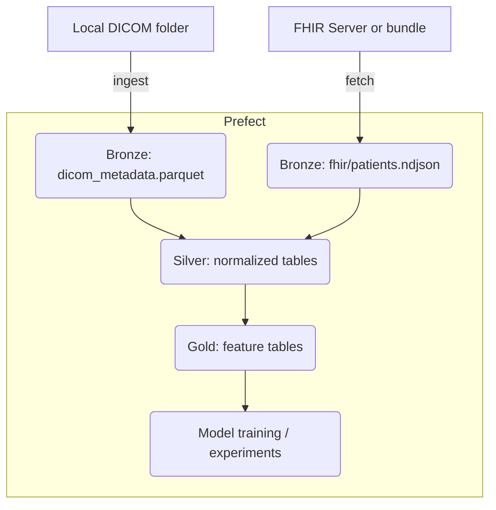

[](https://codecov.io/gh/justin-mbca/theranostics)


Theranostics - Local prototype

This repository contains a minimal local prototype for the Biomedical Data Scientist pipeline.

What it does
- Generates a synthetic cohort (clinical features + time-to-event labels).
- Runs a Prefect flow that writes the dataset and fits baseline survival models (Kaplan-Meier, CoxPH).

Quickstart (macOS / bash)

1) Create a venv and install requirements

```bash
python3 -m venv .venv
source .venv/bin/activate
pip install -r requirements.txt
```

2) Run the demo

```bash
python scripts/run_demo.py
```

3) Run tests

```bash
pytest -q
```

Run the Prefect demo (local):

```bash
# ensure venv activated
python -m pip install -r requirements.txt
python -c "from theranostics.flow import pipeline_with_dicom; pipeline_with_dicom(dicom_dir='path/to/dicom', out_parquet='data/bronze/dicom.parquet')"
```

Documentation
-------------
For this feature branch we've added short docs describing the synthetic input simulation and how to interpret experiment outputs:

- `docs/input_simulation.md` — explains the cohort generator and parameters
- `docs/results_explanation.md` — explains Kaplan–Meier and Cox outputs and interpretation


Coverage report (locally):

```bash
pytest --cov=theranostics --cov-report=xml:coverage.xml
```

Notes
- This is a small local prototype. For production use the architecture in the design doc: object storage, feature store, secured FHIR/DICOM connectors, and managed model infra.

Analysis workflow
-----------------
This project follows a simple Bronze → Silver → Gold ETL and analysis pattern:

- Bronze: raw ingests and minimal metadata. Example: DICOM metadata Parquet files in `data/bronze/` and raw FHIR ndjson in `data/bronze/fhir/`.
- Silver: normalized, typed, and joined tables useful for analysis (parquet tables partitioned by date, patient, or study).
- Gold: analysis-ready features, cohort tables, and model inputs derived from silver data (feature store or simple CSV for experiments).

Orchestration
-------------
We use a lightweight Prefect flow for local orchestration (`theranostics/flow.py`). Typical steps:

1. Ingest DICOM directory → write `data/bronze/dicom_metadata.parquet` (task: `dicom_ingest_task`).
2. Ingest FHIR patient bundle(s) → write `data/bronze/fhir/patients.ndjson` (task: `fetch_patients`).
3. Transform bronze → silver (normalization, join, de-id) — typically a Prefect task or a batch Spark/pandas job.
4. Feature engineering → gold (feature store or CSV) and model training (call `train_models`).

Mermaid diagram (ETL + orchestration)


Try it locally
--------------
Run the DICOM ingest and Prefect flow end-to-end (example):

```bash
# ingest DICOM to parquet
python scripts/ingest_dicom.py /path/to/dicom data/bronze/dicom_metadata.parquet

# run the pipeline (this will run data generation + models + dicom ingest task)
python -c "from theranostics.flow import pipeline_with_dicom; pipeline_with_dicom(n=200, dicom_dir='/path/to/dicom', out_parquet='data/bronze/dicom_metadata.parquet')"
```

Notes and considerations
------------------------
- De-identification: ensure PHI is removed before storing or sharing images/notes. Implement DICOM de-id as a Prefect task in the bronze→silver step.
- Storage: for production, write bronze/silver/gold into object storage (S3) and register datasets in a feature store.
- Reproducibility: pin dependency versions and capture environment with a lockfile or container image.

AI input / DICOM preprocessing (how 2D images are created for CNNs)
---------------------------------------------------------------
- Read `pydicom.dataset.FileDataset` and obtain the pixel array: `arr = ds.pixel_array`.
- Apply modality rescale when present: `arr = arr * RescaleSlope + RescaleIntercept`.
- Correct PhotometricInterpretation (invert for `MONOCHROME1`) and honor `PixelRepresentation` (signed vs unsigned).
- Use WindowCenter/WindowWidth when available. For CT defaults use modality-appropriate windows (e.g., soft-tissue: C=40,W=400; lung: C=-600,W=1500).
- Clip/scale the windowed data and normalize (min-max to 0..1 or z-score). For transfer learning, convert to 3-channel and apply ImageNet mean/std.
- Resample or resize to a consistent pixel spacing and image size. Use SimpleITK for medically-correct resampling if exact spacing preservation is required.
- Cache preprocessed arrays (NPZ/HDF5) to avoid expensive repeated DICOM decoding during training.

Artifacts, ML runs, and repository hygiene
-----------------------------------------
- Experiment artifacts and local MLflow-style runs are saved under `mlruns/` and `artifacts/experiments/` by the demo flows. These are useful for reproducibility but are usually not committed to Git for large projects.
- Recommended actions:
	- Add `mlruns/`, `artifacts/`, and `data/` to `.gitignore` for normal development.
	- If you accidentally committed large artifacts and want to remove them from history, use `git rm --cached` and optionally `git filter-repo` or `git filter-branch` (careful: rewrites history).

Next steps (optional)
---------------------
- Add `theranostics/image_prep.py` with the `dicom_to_array`, `apply_window`, and `prepare_dicom_image` helpers used by the demo. I can add this module and a small notebook that visualizes windowed results.
- Convert the CI smoke script into a pytest-based smoke test (so CI reports it in JUnit output).

If you'd like, I can add the `image_prep` module and demo notebook now and create a small test that verifies `RescaleIntercept` and windowing behavior.
