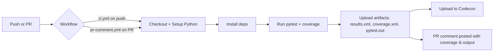

CI & PR Workflows
=================

Overview
--------
This document explains the GitHub Actions workflows added to this repository:

- `.github/workflows/ci.yml` — run on push to `main` and on PRs; installs deps, runs pytest with coverage, uploads `results.xml` and `coverage.xml`, and sends coverage to Codecov.
- `.github/workflows/pr-comment.yml` — runs on PR open/sync/reopen, executes the same tests, uploads artifacts, computes a single coverage percent from `coverage.xml`, and posts a comment on the PR with the coverage and truncated pytest output.

Why these workflows
-------------------
- CI ensures the main branch stays green and artifacts are available.
- PR workflow provides quick feedback directly on the PR with test results and coverage, reducing context switching for reviewers.

Artifacts produced
------------------
- `results.xml` — JUnit XML produced by pytest (--junitxml), useful for CI dashboards and test reporting.
- `coverage.xml` — Cobertura-style XML from pytest-cov, used for computing a coverage percentage and uploading to Codecov.
- `pytest.out` — captured console output used in PR comments for quick diagnostics.

Secrets & external integrations
------------------------------
- `CODECOV_TOKEN` (optional) — required for Codecov uploads if this repository is private. Add it as a repository secret (Settings → Secrets and variables → Actions).

Step-by-step: `ci.yml`
----------------------
1. Checkout repository.
2. Set up Python 3.10.
3. Cache pip packages.
4. Install dependencies from `requirements.txt` and `pytest-cov`.
5. Run pytest with coverage and generate `results.xml` and `coverage.xml`.
6. Upload `results.xml` and `coverage.xml` as workflow artifacts.
7. Upload coverage to Codecov (best-effort; CI will not fail if Codecov upload fails).

Step-by-step: `pr-comment.yml`
-----------------------------
1. Checkout repository and set up Python.
2. Install dependencies and `pytest-cov`.
3. Run pytest with coverage, capture the console output to `pytest.out`.
4. Upload `results.xml`, `coverage.xml`, and `pytest.out` as artifacts.
5. Parse `coverage.xml` (best-effort) to compute a single coverage percentage and write it to `coverage.txt`.
6. Post a PR comment that includes:
   - "Automated tests completed."
   - Coverage percentage (from `coverage.txt`).
   - Collapsible block with the first ~1000 chars of `pytest.out` for quick troubleshooting.

Mermaid diagram (high-level)
-----------------------------

Troubleshooting
---------------
- Coverage missing: make sure `pytest-cov` is installed and the pytest command includes `--cov-report=xml:coverage.xml`.
- Long test output: the PR comment includes a truncated section — download the `pytest.out` artifact from the Actions run for full logs.
- Codecov returns errors: if your repo is private, ensure `CODECOV_TOKEN` is added as a secret.

Extending the workflows
-----------------------
- Add a job matrix to run tests across multiple Python versions.
- Add caching for wheelhouse or virtualenv directories for faster installs.
- Add integration with CodeQL or other static analysis tools.

Where the code lives
--------------------
- CI workflow: `.github/workflows/ci.yml`
- PR comment workflow: `.github/workflows/pr-comment.yml`
