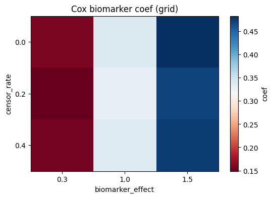
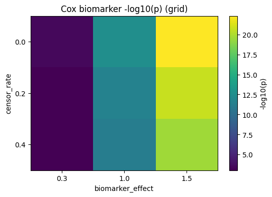

## Grid sweep report — theranostics

Brief summary: this report summarizes a 3×3 grid sweep over `censor_rate` and `biomarker_effect` performed with the theranostics experiment runner. Results and artifacts are in `artifacts/experiments/` and run summaries are written to `mlruns/theranostics_local/`.

### Key results (excerpt)

The table below is a small excerpt from `artifacts/experiments/grid_sweep_results.csv`.

| censor_rate | biomarker_effect | coef | p | exp(coef) | event_rate |
|---:|---:|---:|---:|---:|---:|
| 0.0 | 0.3 | 0.158 | 3.83e-04 | 1.171 | 0.982 |
| 0.0 | 1.0 | 0.339 | 2.92e-13 | 1.404 | 0.972 |
| 0.0 | 1.5 | 0.483 | 4.69e-23 | 1.620 | 0.948 |
| 0.4 | 1.5 | 0.475 | 2.56e-20 | 1.607 | 0.848 |

Interpretation: the hazard coefficient for the biomarker (`coef`) increases with `biomarker_effect` as expected; p-values remain strongly significant across the tested range. Event rate falls with higher censoring.

### Artifacts

- `artifacts/experiments/grid_sweep_results.csv` — full numeric results and run metadata.
- `artifacts/experiments/grid_coef.png` — heatmap of estimated biomarker coefficients.
- `artifacts/experiments/grid_pvalues.png` — heatmap of p-values.

Embedded visuals (refer to files in repo):





### Reproduce locally

1. Create and activate the project's Python environment (example using virtualenv):

```bash
python -m venv .venv
source .venv/bin/activate
pip install -r requirements.txt
```

2. Re-run the grid sweep script (from repo root):

```bash
python -m theranostics.scripts.run_grid_sweep
```

This will write artifacts to `artifacts/experiments/` and summaries to `mlruns/theranostics_local/`.

### Next steps & notes

- Consider adding a short CI smoke test that imports `theranostics` and runs a minimal Cox fit to ensure compatibility between `pandas`, `lifelines`, and `scipy` (this was the reason for the current `theranostics/_compat.py` shim).
- Optionally move the report into a PR description when opening the pull request for `feat/grid-sweep-artifacts`.
- For publication-quality reporting, generate a standalone HTML or PDF with the full tables and figures.

Report generated automatically and added to branch `feat/grid-sweep-artifacts`.
